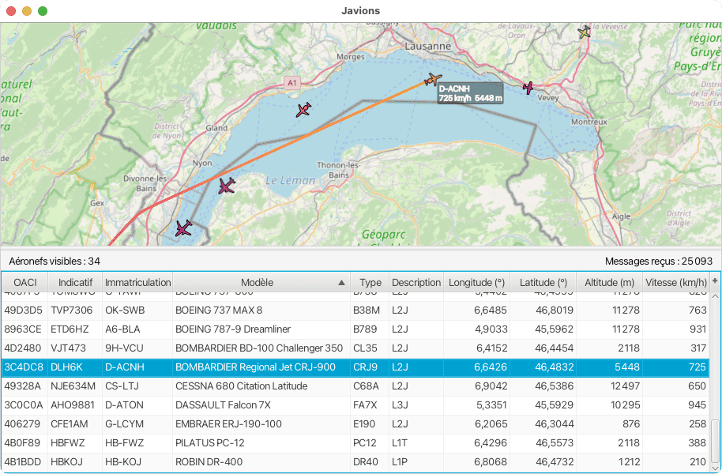

# Javions

<br>
<br>

<p align="center"><em> A preview of our app </em></p>

**Javions** is a first-year programming project designed to facilitate air traffic control by decoding ADS-B (Automatic Dependent Surveillance – Broadcast) messages and displaying aircraft on a map in real time. It was done as part of the course "Practice of object-oriented programming" (CS-108) at EPFL in joint effort with my friend Yassine. The course webpage: https://cs108.epfl.ch/archive/23/archive.html

---

## Table of Contents

- [Overview](#overview)
- [Features](#features)
- [Project Structure](#project-structure)
- [Requirements](#requirements)
- [Usage](#usage)
  - [Live Mode](#live-mode)
  - [Playback Mode](#playback-mode)
- [Message Processing & Threading](#message-processing--threading)
- [Limitations](#limitations)
- [Acknowledgments](#acknowledgments)

---

## Overview

Aircraft—and other airborne vehicles such as helicopters and balloons—continuously broadcast digital radio messages known as **ADS-B messages**. These messages provide essential information about the sender, including its identity, position, speed, and direction.

**Javions** is designed to:
- **Decode ADS-B messages:** It receives digital radio messages via a software-defined radio (SDR), specifically the AirSpy R2.
- **Display aircraft positions:** The decoded information is shown on a map, along with a detailed table listing each aircraft.
- **Offer a user-friendly interface:** The GUI comprises three parts:
  1. **Aircraft View:** A map showing the positions of detected aircraft.
  2. **Status Bar:** Displays the total number of valid messages received and the count of aircraft listed.
  3. **Aircraft Table:** Contains detailed information about each detected aircraft.

Selecting an aircraft in the table highlights it on the map and vice versa. A double-click in the table will center the map on the selected aircraft.

---

## Features

- **Real-Time Data Processing:** Decodes live ADS-B messages received via the AirSpy R2 SDR.
- **Dual Interface Display:**
  - A map view that visually tracks aircraft positions.
  - A table view listing aircraft details.
- **Status Monitoring:** Keeps track of:
  - The total number of valid messages received since the program started.
  - The number of aircraft currently displayed (based on the table entries).
- **Interactive Selection:** Syncs selection between the map and the table. Double-clicking in the table centers the map on the selected aircraft.
- **Dual Modes of Operation:**
  - **Live Mode:** Reads data from standard input (using Java's `System.in`), ideal for direct SDR input.
  - **Playback Mode:** Processes recorded ADS-B messages from a file, respecting the original timestamps to simulate real-time movement.


## Requirements

### Hardware

- **AirSpy R2 Software-Defined Radio (SDR):** For capturing live ADS-B messages.
- **Antenna:** Must be properly positioned (e.g., on a rooftop) to ensure a clear line of sight to aircraft.

### Software

- **Java Development Kit (JDK) 8 or later**
- **GUI Libraries:** JavaFX or Swing (depending on the implementation).
- Additional dependencies may be required as specified in the project documentation.

---

## Usage

### Live Mode

When no arguments are provided, **Javions** expects to receive live ADS-B samples from the SDR via standard input.

```bash
java -jar Javions.jar
```

> **Note:** Ensure that the AirSpy R2 is connected to both the antenna and your computer. The program reads data from `System.in`.

### Playback Mode

For testing purposes, you can supply a file containing recorded ADS-B messages. The file should have the same format as provided in step 7 of the project's website (e.g., `messages_20230318_0915.bin`). In this mode, message timestamps are followed—each message is processed only after a duration equal to its timestamp has elapsed since the program started.

```bash
java -jar Javions.jar messages_20230318_0915.bin
```

This simulates real-time aircraft movement on the map.

---

## Message Processing & Threading

**Javions** uses a separate thread dedicated to reading ADS-B messages. This ensures that the GUI remains responsive while processing incoming data concurrently.

---

## Bonus Features

The following additional features have been implemented as bonus tasks:

1. **Aircraft Follow Mode:**
   - **Description:** When an aircraft is clicked, the map remains centered on it until another aircraft is selected. This ensures that as the aircraft moves, it stays at the center of the canvas.
   - **Implementation:** A listener was added to the selected aircraft’s position attribute within the `AircraftController` class (which now includes a `BaseMapController` attribute) to automatically recenter the map whenever the aircraft's position changes.

2. **Aircraft Image Column:**
   - **Description:** An additional column in the aircraft table displays the latest image of each aircraft, retrieved via its ICAO address.
   - **Implementation:** Using the `org.json` library, the application sends a request to the planeSpotters API to fetch a JPG image. The JSON response is parsed to extract the image URL, images are stored in an "image-storing" folder, and they are displayed in the table using `ImageView` nodes.
3. **Distance Indicator Circles:**
   - **Description:** Circles are drawn on the map to indicate distance ranges from a reference point (the library). For example, a green circle indicates that an aircraft is within 50 km, a yellow circle for 100 km, and a red circle for 200 km.
   - **Implementation:** Leveraging JavaFX's `Canvas` graphic context:
     - `setFill()` is used to set the drawing color.
     - `fillOval()` is employed to draw circles. The circle's radius in pixels is calculated using the Mercator projection formula:
       ```
       pixelDistance = C * cos(latitude) / 2^(zoom + 8)
       ```
       where `C` is Earth's equatorial circumference (~40,075 km).
     - The calculated pixel distance determines how many pixels represent a given distance (e.g., 50 km).
     - `setGlobalAlpha()` is used to apply transparency, ensuring the circles do not obscure the map details.
     - The circles are redrawn with the map tiles so that they move appropriately as the map is navigated.

---

## Limitations

- **Reception Range:** Due to the Earth's curvature, ADS-B messages can only be received from aircraft within a few hundred kilometers of the receiver. Thus, when using an SDR, **Javions** will primarily display aircraft in the vicinity of Lausanne.
- **Extended Coverage:** Tracking aircraft over a larger area would require aggregating data from multiple SDRs or leveraging internet-based ADS-B data sources, which is outside the scope of this project.

---

## Acknowledgments

This project was developed as a first-year programming assignment to explore:
- Real-time data processing
- GUI development
- Multithreading in Java

Special thanks to the instructor Michel Schinz and the wider aviation and SDR communities for their support and resources.

